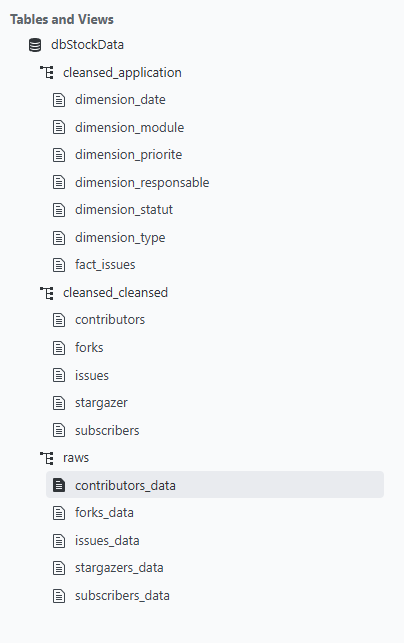
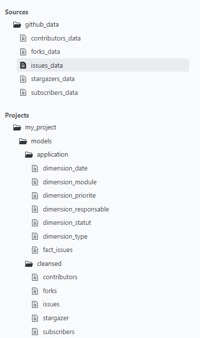
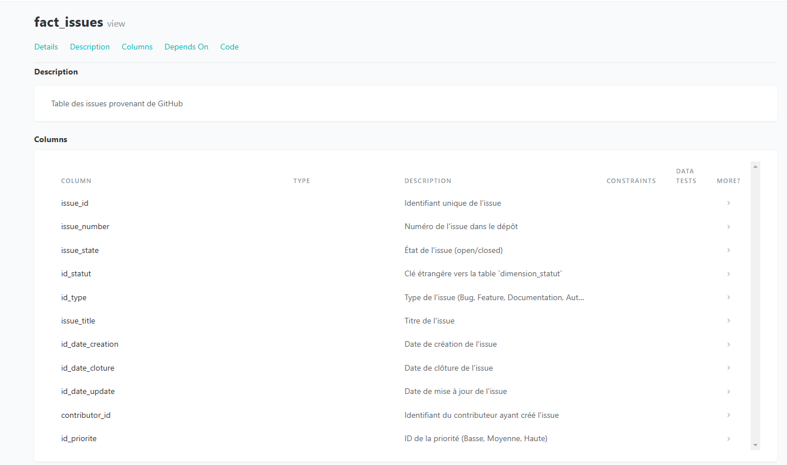
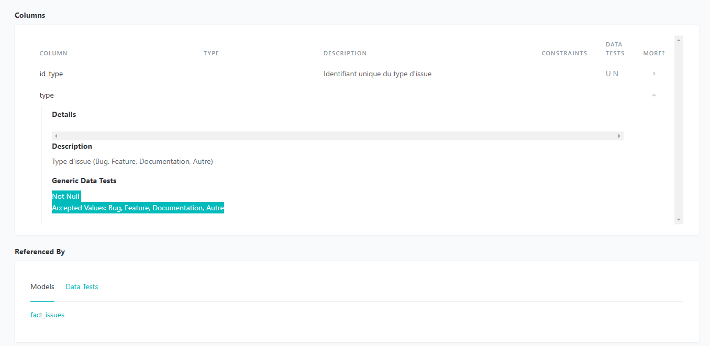
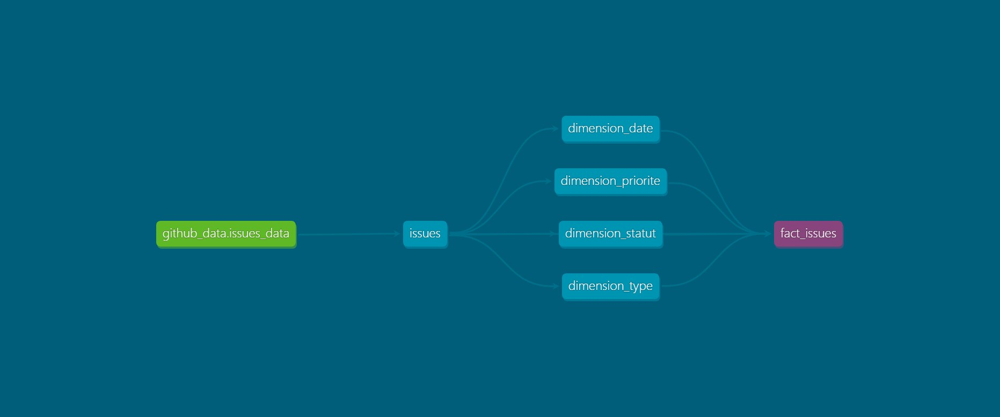
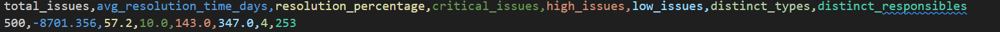

# Projet de gestion des Issues GitHub

## Objectif du projet
Ce projet a pour objectif d'analyser les issues GitHub d'un dépôt spécifique, tel que le dépôt `vuejs/core`, en utilisant DBT pour transformer les données et des API GitHub pour collecter les informations. Les données collectées concernent plusieurs aspects du dépôt, tels que les issues, les contributeurs, les forks, les abonnés et les stargazers. Ces informations sont ensuite utilisées pour alimenter un modèle de données `fact_issues`.

Le modèle `fact_issues` permet de fournir des analyses détaillées des issues en fonction de plusieurs dimensions : le statut de l'issue, son type, sa priorité, ainsi que des informations temporelles et les contributeurs responsables.

## Prérequis
Avant de commencer, assurez-vous de disposer des éléments suivants :
- **DBT** : Utilisé pour la transformation des données.
- **Accès à l'API GitHub** : Un token GitHub valide est nécessaire pour accéder aux données des repos.
- **Un projet DBT configuré** : Le projet doit être configuré pour interagir avec DuckDB ou une autre base de données compatible avec DBT.

### Commandes de gestion DBT :
Voici les commandes pour gérer et exécuter les transformations dans DBT :
- **`dbt clean`** : Nettoie le répertoire des artefacts de précédents runs.
- **`dbt deps`** : Installe les dépendances du projet DBT.
- **`dbt build`** : Construit tous les modèles et tests dans le projet.
- **`dbt run`** : Exécute tous les modèles définis dans le projet.

## Étape 1 - Collecte des données
Les données sont collectées via l'API GitHub pour obtenir des informations sur plusieurs entités importantes du dépôt :
- **Contributeurs** : Identifiants des utilisateurs ayant contribué au dépôt.
- **Forks** : Données sur les forks créés à partir du dépôt.
- **Issues** : Problèmes ou demandes associés au dépôt.
- **Abonnés** : Liste des utilisateurs abonnés au dépôt.
- **Stargazers** : Utilisateurs ayant marqué le dépôt comme "étoilé".

### Stockage des données :
Les données sont récupérées et stockées localement sous forme de fichiers **Parquet**. Ces fichiers servent à la transformation et à l'alimentation des modèles DBT dans les étapes suivantes.

## Étape 2 - Modélisation des données avec DBT

### Documentation DBT
Le modèle `fact_issues` permet d'analyser les issues dans un dépôt GitHub. Ce modèle est enrichi par des informations provenant de plusieurs dimensions clés :
- **dimension_statut** : Contient des informations sur l'état de l'issue (ouverte/fermée).
- **dimension_type** : Type d'issue (Bug, Feature, Documentation, Autre).
- **dimension_priorite** : Priorité de l'issue (Basse, Moyenne, Haute).
- **dimension_date** : Informations temporelles concernant la création, la mise à jour et la clôture des issues.
- **dimension_responsable** : Identifie le contributeur responsable de l'issue.

Ces dimensions permettent une analyse approfondie des issues, en enrichissant les données de base avec des informations supplémentaires sur le statut, la priorité, le type, et la responsabilité.





#### Tests sur les modèles DBT
Des tests ont été mis en place pour garantir la cohérence et la qualité des données dans les modèles DBT. Voici un aperçu des tests effectués pour valider les données :


Ces tests assurent que les relations entre les différentes dimensions sont respectées et que les données de base sont fiables, ce qui permet de garantir la qualité de l'analyse des issues.

### Graphe DAG des modèles DBT
Le graphe DAG (Directed Acyclic Graph) présente les relations et dépendances entre les modèles DBT du projet. Il montre comment les tables de dimensions et le modèle `fact_issues` sont interconnectés. Ce graphique permet de visualiser l'architecture des données et les flux de transformation dans DBT.



## Étape 3 - Génération de la documentation DBT
La documentation de vos modèles DBT peut être générée avec les commandes suivantes :

```bash
dbt docs generate
dbt docs serve
```

## Étape 4 - Analyse des indicateurs dans le modèle `fact_issues`

Le modèle `fact_issues` permet d'obtenir des indicateurs clés sur les issues du dépôt GitHub. Ces indicateurs sont calculés à partir des données collectées et transformées par DBT. Voici les principaux indicateurs analysés :

### Indicateurs du modèle `fact_issues` :
- **`total_issues`** : Le nombre total d'issues présentes dans le dépôt.
- **`avg_resolution_time_days`** : Le délai moyen, en jours, entre l'ouverture et la fermeture des issues. Ce calcul prend en compte uniquement les issues fermées.
- **`resolution_percentage`** : Le pourcentage d'issues résolues par rapport au nombre total d'issues.
- **`critical_issues`** : Le nombre d'issues critiques (ayant une priorité élevée).
- **`high_issues`** : Le nombre d'issues avec une priorité élevée.
- **`low_issues`** : Le nombre d'issues avec une priorité faible.
- **`distinct_types`** : Le nombre de types distincts d'issues (Bug, Feature, Documentation, Autre).
- **`distinct_responsibles`** : Le nombre de responsables distincts ayant pris en charge les issues.

### Dimensions utilisées dans le modèle :
Les dimensions utilisées pour analyser les issues sont :
- **Date (ouverture, fermeture)** : Les dates de création, de mise à jour et de clôture des issues.
- **Priorité** : La priorité de l'issue, qui peut être classée comme **Critique**, **Haute**, **Moyenne** ou **Basse**.
- **Type** : Le type d'issue, qui peut être un **Bug**, une **Amélioration**, ou une **Documentation**.
- **Responsable** : Le nom du contributeur responsable de l'issue.
- **Statut** : Le statut de l'issue, soit **ouverte** ou **fermée**.
- **Module concerné** : L'indication du module concerné par l'issue.

### Exemple de résultat :
Voici un exemple de résultat du modèle `fact_issues` après transformation et analyse des données du dépôt GitHub :



| total_issues | avg_resolution_time_days | resolution_percentage | critical_issues | high_issues | low_issues | distinct_types | distinct_responsibles |
|--------------|---------------------------|-----------------------|------------------|--------------|------------|----------------|-----------------------|
| 500          | -8701.356                 | 57.2                  | 10.0             | 143.0        | 347.0      | 4              | 253                   |

### Explication des résultats :
- Le **nombre total d'issues** (`total_issues`) représente la totalité des issues existantes dans le dépôt.
- Le **délai moyen entre l'ouverture et la fermeture des issues** (`avg_resolution_time_days`) est calculé en prenant la différence entre la date de création et la date de clôture de chaque issue, avec un ajustement pour celles qui sont encore ouvertes. Dans cet exemple, le délai moyen semble être un nombre négatif, ce qui pourrait indiquer des erreurs dans les données de date.
- Le **pourcentage d'issues résolues** (`resolution_percentage`) montre que 57,2 % des issues ont été fermées.
- Le nombre d'**issues critiques**, **élevées** et **faibles** est également calculé.
- **Les types distincts** d'issues sont au nombre de 4, indiquant que plusieurs catégories d'issues ont été créées.
- Le **nombre de responsables distincts** est de 253, ce qui représente la diversité des contributeurs ayant géré des issues dans ce dépôt.

### Problèmes potentiels :
Il est important de noter que certaines valeurs peuvent être nulles, en particulier pour les issues qui n'ont pas encore été fermées. Dans de tels cas, des ajustements sont faits dans les calculs, notamment pour le délai moyen.

## Conclusion
Ce projet fournit une analyse complète des issues dans un dépôt GitHub en utilisant DBT pour la transformation des données. Les informations collectées depuis l'API GitHub sont enrichies à travers un modèle `fact_issues`, qui permet de calculer divers indicateurs pour évaluer l'état et la gestion des issues d'un projet.

N'hésitez pas à explorer la documentation générée avec DBT pour en savoir plus sur la structure de la base de données et sur la façon dont les données sont modélisées et analysées.

---

